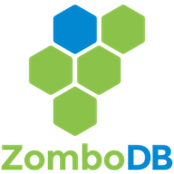

[](https://www.zombodb.com/) 
###### Making Postgres and Elasticsearch work together like it's 2018
[](https://travis-ci.com/zombodb/zombodb)

ZomboDB brings powerful text-search and analytics features to Postgres by using Elasticsearch as an index type.  Its comprehensive query language and SQL functions enable new and creative ways to query your relational data.

From a technical perspective, ZomboDB is a 100% native Postgres extension that implements Postgres' Index Access Method API.  As a native Postgres index type, ZomboDB allows you to `CREATE INDEX ... USING zombodb` on your existing Postgres tables.  At that point, ZomboDB takes over and fully manages the remote Elasticsearch index and guarantees transactionally-correct text-search query results.

ZomboDB is fully compatible with all of Postgres' query plan types and most SQL commands such as `CREATE INDEX`, `COPY`, `INSERT`, `UPDATE`, `DELETE`, `SELECT`, `ALTER`, `DROP`, `REINDEX`, `(auto)VACUUM`, etc.

It doesn’t matter if you’re using an Elasticsearch cloud provider or managing your own cluster -- ZomboDB communicates with Elasticsearch via its RESTful APIs so you’re covered either way.

ZomboDB allows you to use the power and scalability of Elasticsearch directly from Postgres.  You don’t have to manage transactions between Postgres and Elasticsearch, asynchronous indexing pipelines, complex reindexing processes, or multiple data-access code paths -- ZomboDB does it all for you.

## Currently BETA

This is a new version of ZomboDB that only supports Postgres 10 and doesn't require an Elasticsearch plugin.  As such, it's currently a beta release, with a production-ready release planned for the near future.

If you've used ZomboDB before, you'll learn that this is a different and more advanced product. Please review all the documentation as many things (including SQL syntax and query language) have changed.

Previous versions that support Postgres <=9.5 are still available, from these branches:

- [Support for Elasticsearch 5.6](https://github.com/zombodb/zombodb/tree/master-es5.6)
- [Support for Elasticsearch 2.4](https://github.com/zombodb/zombodb/tree/master-es2.4)
- [Support for Elasticsearch 1.7](https://github.com/zombodb/zombodb/tree/master-es1.7)

Commerical support for all versions of ZomboDB is available by [contacting ZomboDB, LLC](https://www.zombodb.com/services/).


## Quick Links

 - [Installation Instructions](INSTALL.md)
 - [Getting Started Tutorial](TUTORIAL.md)
 - [Important Things to Know](THINGS-TO-KNOW.md)
 - [Query DSL](QUERY-DSL.md)
 - [Aggregations](AGGREGATIONS.md), [Table Samplers](TABLE-SAMPLERS.md), [Scoring and Highlighting](SCORING-HIGHLIGHTING.md)
 - [SQL Functions](SQL-FUNCTIONS.md)
 - [Configuration Settings](CONFIGURATION-SETTINGS.md), [Index Managment](INDEX-MANAGEMENT.md)
 - [Type Mapping](TYPE-MAPPING.md)
 - [Elasticsearch _cat API](CAT-API.md)
 - [VACUUM Support](VACUUM.md)

 
## Features

 - MVCC-correct text-search and aggregation results
 - Managed and queried via standard SQL
 - Works with current Elasticsearch releases (no plugins required)
 - Query using
    - Elasticsearch's [Query String Syntax](https://www.elastic.co/guide/en/elasticsearch/reference/current/query-dsl-query-string-query.html#query-string-syntax)
    - Raw Elasticsearch QueryDSL JSON
    - ZomboDB's type-safe query builder SQL syntax
    - Any combination of the above, even in combination with standard SQL
 - [Scoring and Highlighting Support](SCORING-HIGHLIGHTING.md)
 - Support for all Elasticsearch aggregations
 - Automatic Elasticsearch Mapping Generation
    - Ability to map custom domains
    - Per-field custom mappings
    - `json/jsonb` automatically mapped as dynamic nested objects
    - Supports full set of [Elasticsearch language analyzers](https://www.elastic.co/guide/en/elasticsearch/reference/current/analysis-lang-analyzer.html)
 - Hot-Standby compatible


## System Requirements
 
 Product       | Version 
---           | ---      
Postgres      | 10.x
Elasticsearch | 5.6.x, 6.x
libcurl       | >=7.28.0


## Downloading

Please visit [https://www.zombodb.com/releases/](https://www.zombodb.com/releases/) to download.

If you want to integrate with a CI/CD system you can intuit the pattern for versions from the Postgres extension download links, but it'll be something like:

```
https://www.zombodb.com/releases/VERSION/zombodb_trusty_pg10-VERSION_amd64.deb
```

Note:  you'll need to use the one that's for your Postgres + Linux distro combination -- the example above is for Postgres 10 on Ubuntu Trusty.


## Quick Overview

Note that this is just a quick overview.  Please read the [getting started tutorial](TUTORIAL.md) for more details.

Create the extension:

```sql
CREATE EXTENSION zombodb;
```

Create a table:

```sql
CREATE TABLE products (
    id SERIAL8 NOT NULL PRIMARY KEY,
    name text NOT NULL,
    keywords varchar(64)[],
    short_summary text,
    long_description zdb.fulltext, 
    price bigint,
    inventory_count integer,
    discontinued boolean default false,
    availability_date date
);

-- insert some data
```

Create a ZomboDB index:

```sql
CREATE INDEX idxproducts 
          ON products 
       USING zombodb ((products.*)) 
        WITH (url='localhost:9200/');
```

Query it:

```sql
SELECT * 
  FROM products 
 WHERE products ==> '(keywords:(sports OR box) OR long_description:"wooden away"~5) AND price:[1000 TO 20000]';
```


## Contact Information

 - https://www.zombodb.com
 - Google Group: zombodb@googlegroups.com
 - Twitter: [@zombodb](https://twitter.com/zombodb/)
 - via Github Issues and Pull Requests
 - https://www.zombodb.com/services/ or info@zombodb.com for commercial support

 
## History

The name is an homage to zombo.com and its long history of continuous self-affirmation.

This version of ZomboDB was graciously sponsored by [Impira](http://impira.com).

Historically, ZomboDB began in 2013 by Technology Concepts & Design, Inc as a closed-source effort to provide transaction safe text-search on top of Postgres tables. While Postgres' "tsearch" features are useful, they're not necessarily adequate for 200 column-wide tables with 100M rows, each containing large text content.

Initially designed on-top of Postgres' Foreign Data Wrapper API, ZomboDB quickly evolved into an index type so that queries are MVCC-safe and standard SQL can be used to query and manage indices.

Elasticsearch was chosen as the backing search index because of its horizontal scaling abilities, performance, and general ease of use.

ZomboDB was open-sourced in July 2015 and has since been used in numerous production systems of various sizes and complexity.


## License

Copyright 2018 ZomboDB, LLC

Licensed under the Apache License, Version 2.0 (the "License");
you may not use this file except in compliance with the License.
You may obtain a copy of the License at

    http://www.apache.org/licenses/LICENSE-2.0

Unless required by applicable law or agreed to in writing, software
distributed under the License is distributed on an "AS IS" BASIS,
WITHOUT WARRANTIES OR CONDITIONS OF ANY KIND, either express or implied.
See the License for the specific language governing permissions and
limitations under the License.